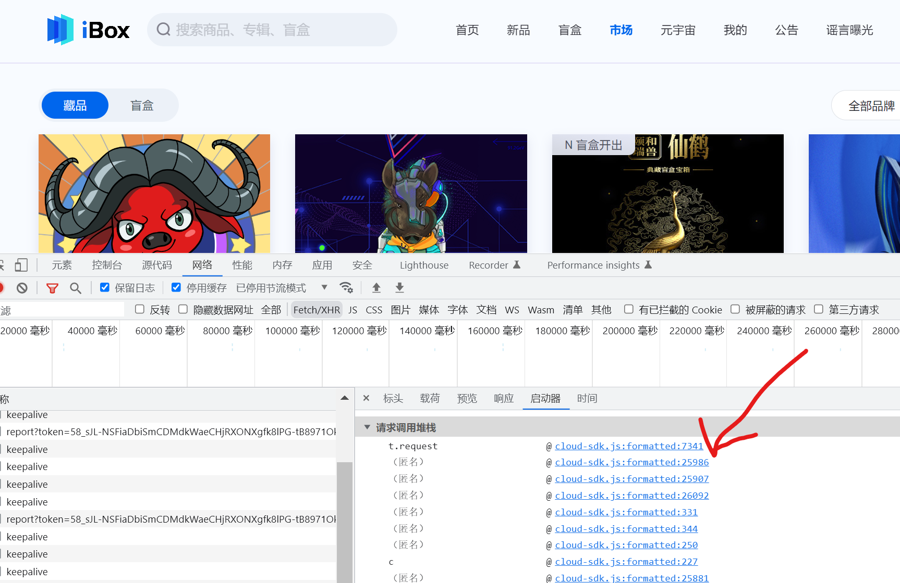

# JS逆向练手项目
- ibox的pc端页面，待解决的问题
    - 1.市场列表页只加载50条数据。
      - 解决方案：根据图片的ID池循环查询①先按‘最新上架’筛选条件筛选出新上架图片的ID集合。②根据新上架图片ID集合，以及前50条对应的ID集合，循环查询指定ID的结果
    - 2.市场列表页数据请求参数和返回值均为加密。
      - JS逆向
    **结论**
    鉴于目前技术储备，未能解决返回值为字节流的问题，初步定位的核心逻辑位于调用栈的倒数第2个函数处，如下图
    